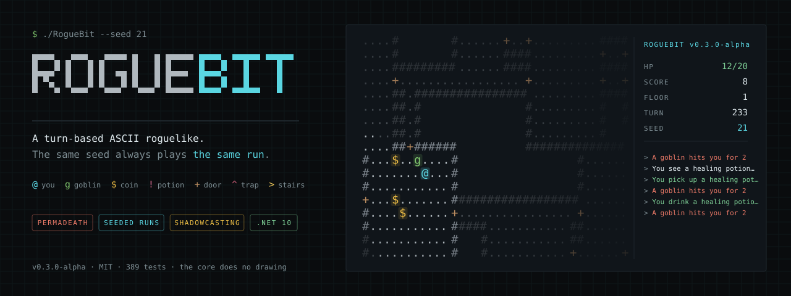
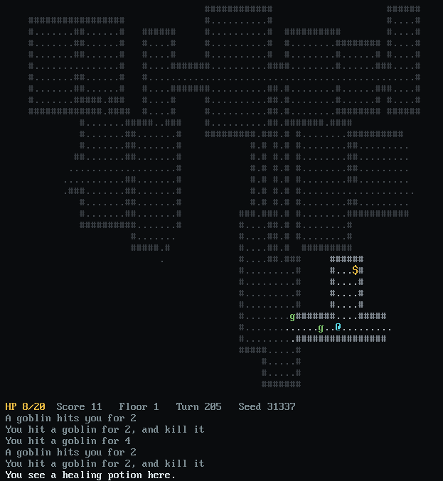

<div align="center">



_Shadowcasting, A\* pursuit and multi-floor dungeons, written from scratch on .NET 10_

<p align="center">
  
  
  
</p>

<p align="center">
  <a href="https://github.com/Stiven-Gjekaj/RogueBit/actions/workflows/ci.yml"></a>
  <a href="https://github.com/Stiven-Gjekaj/RogueBit/releases"></a>
  
</p>

<p align="center">
  <a href="#quick-start"><b>Quick Start</b></a> |
  <a href="#controls"><b>Controls</b></a> |
  <a href="#what-is-in-here"><b>Features</b></a> |
  <a href="#why-this-exists"><b>Why</b></a> |
  <a href="#project-structure"><b>Structure</b></a> |
  <a href="#documentation"><b>Docs</b></a>
</p>

</div>

---

## The game running

<div align="center">
  
</div>

Captured from the real window, on seed 31337. The route was worked out by
playing the same seed headlessly first, because the game is deterministic and
the keys replay the same run.

---

## Sample output

Seed 31337, twenty six turns in. Lit ground is `.`, ground the player has seen
before and now remembers is `,`, and ground never visited is blank.

```
   ###################### #########
   #,,,,,,,,,##,,,,,,,,,# #.......#
   #,,,,,,,,,##,,,,,,,..###.......#
   #,,,,,,,,,##,,,,,,,,,..........#
   #,,,,,,,,,##,,,,,,,,,###.......####.
   #,,,,,,,,,,,,,,,,,,,,# #...@.........
   #,,,,,,,,,############ #.......####.
   #,,,,,,,,,#            #.......#
   #,,,,,,,,,#            #.......#
   ###########            #########
```

This is captured from the running game rather than drawn by hand, which is why
the light stops in the shapes it does.

---

## Why this exists

**The same seed plays the same run, all the way down, and will next year too.**
The generator is PCG written out in the repository rather than
`System.Random`, which does not promise the same sequence across runtime
versions and has already changed once. A test pins the output for seed 12345 to
fixed numbers, so drift becomes a failing build instead of a silent change of
meaning. Restarting builds a fresh source on the same seed rather than carrying
on with one already drawn from, so `R` gives you the run you just lost.

**The algorithms are written out rather than called for.** Field of view is
recursive shadowcasting across eight octants, pathfinding is A\* with a Manhattan
heuristic, and the floors come from a binary space partition or a drunkard walk.
None of that is a library call, and all of it is covered by tests that state the
map they need in ASCII rather than asking a generator for one.

**The rules do not know how to draw.** `RogueBit.Core` has no rendering
dependency at all. A whole game can be played out in a test with no display
attached, which is how the run above was captured. The SadConsole window reads
what the core says is true and draws it.

---

## Quick Start

Prerequisites: the [.NET 10 SDK](https://dotnet.microsoft.com/download).

```sh
git clone https://github.com/Stiven-Gjekaj/RogueBit
cd RogueBit
dotnet run --project src/RogueBit.Console
```

To play a dungeon you can come back to:

```sh
dotnet run --project src/RogueBit.Console -- --seed 31337
```

| Option | What it does |
| --- | --- |
| `--seed <number>` | Plays a named dungeon. The same seed replays the same run. |
| `--continue` | Picks up the saved run, if there is one. |
| `--print-floor` | Prints a floor as text and exits. No window opens. |
| `--depth <number>` | Which floor to print, 1 to 10. Only with `--print-floor`. |
| `--colour-blind` | Uses a palette that does not rely on red against green. |
| `--no-effects` | Turns off the particles and the screen shake. |
| `--help` | Prints the options and exits. |

Run the tests with `dotnet test`.

---

## Controls

| Keys | Action |
| --- | --- |
| Arrows, WASD, hjkl, numpad | Move, or attack whatever you walk into |
| `y` `u` `b` `n`, numpad 7 9 1 3 | Move diagonally |
| `.` or numpad 5 | Wait a turn |
| `g` | Pick up what is under you |
| `,` | Take the stairs you are standing on, up or down |
| `i` | Open the pack, then a letter to use an item |
| `m` | Read back through the whole log |
| `s` | Save the run |
| `r` | Start the same seed again |
| `Escape` | Close what is open, or save and leave |

Coins are taken by walking over them. Everything else has to be picked up.

A diagonal between two walls that meet at a corner is refused, for the player
and for the monsters alike. Sliding through solid rock is not a move.

Leaving with `Escape` writes the run, so `--continue` picks it up where you
stopped. A run that ends is removed, so dying cannot be undone by loading.

---

## What is in here

- **Two dungeon generators.** Odd floors are rooms and corridors from a binary
  space partition. Even floors are caves from a drunkard walk. Both are checked
  against the same contract over forty seeds.
- **Field of view with memory.** Recursive shadowcasting, with ground you have
  seen staying on the map dimmed once you walk away from it.
- **Doors that block sight but not movement.** The one tile in the game where
  those two disagree. A corridor no longer shows you what is waiting at the far
  end of it.
- **Hidden traps.** Drawn as ordinary ground until something stands on one, and
  they do not care who that was, so leading a jackal across one is a real move.
  More of them, hitting harder, the deeper you go.
- **Four kinds of monster.** Goblins chase. Jackals take two steps for each of
  yours. Archers keep their distance and shoot along a clear line. A warden
  stands on every fifth floor and hits twice as hard once it is below half
  health.
- **Depth that costs something.** Monsters grow in number and strength as you
  descend while potions grow scarcer, and the harder kinds only unlock deeper
  down, so the first floor is always goblins.
- **An ending.** Floor ten has no stairs and a warden twice the size of the one
  halfway down. Killing it wins the run and is worth far more than surviving.
- **A way back up.** Every floor below the first has stairs where you came in,
  and a floor you leave is the floor you find when you return: the same ground,
  the same monsters still standing where you left them, and whatever you walked
  past still lying there. Retreating to ground you have already cleared is a
  real move, and the depth bonus is paid on how deep you got rather than where
  you are standing, so turning back costs no points.
- **Equipment.** A weapon slot and an armour slot, both reading straight through
  to the numbers combat uses.
- **A message log** that counts a repeated line rather than letting a run of
  misses push everything else off the panel, and `m` to read back through all
  hundred lines of it rather than the six the panel shows.
- **A pack that keeps its order**, grouped by kind with potions first, so the
  letter for a potion does not move every time you pick something up.
- **Movement in eight directions**, for the monsters as well as for you.
- **Saving and resuming.** The floor, the pack, what you have explored and the
  exact state of the dice all come back, so a resumed run plays on rather than
  replaying the seed.
- **Hit flashes, sparks and screen shake**, which the core knows nothing about
  and `--no-effects` switches off entirely.

---

## Project structure

```
src/RogueBit.Core/      The rules. No rendering dependency of any kind.
  Map/                  Generators, regions, the map itself
  Vision/               Shadowcasting and line of sight
  Pathing/              A*
  Entities/             Player, monsters, the actor they share
  Items/                Items, the pack and the two slots
  Combat/               What one attack does
src/RogueBit.Console/   The SadConsole window. Draws the core, holds no rules.
tests/RogueBit.Core.Tests/      The rules, run headless in CI
tests/RogueBit.Console.Tests/   The effects, which decide without drawing
tools/RogueBit.BannerFrame/     Captures the dungeon used in the banner
scripts/                Builds assets/banner.svg from that capture
```

---

## Documentation

- [Architecture and algorithms](docs/architecture.md)
- [Milestones and roadmap](docs/milestones.md)
- [Changelog](CHANGELOG.md)
- [Contributing](CONTRIBUTING.md)

---

## Status

Alpha. The game is playable from the first floor to the warden at the bottom.
328 tests cover it: 284 against the rules and 44 against the frontend, which
covers the effects, the scrolling of the log and the command line. The window itself is compiled on three platforms but never run
by continuous integration, because it needs a display.

## Licence

MIT. See [LICENSE](LICENSE).
